# Chana Monitoring System

The *Chana Monitoring System (CMS)* is a home project for something as simple as controlling that a deposit of water does not overflow when an A/C system has been running unattended for long time.
Since I already had the materials, it already contains a DHT22 sensor for measuring termperature and humidity.
The CMS has been designed with three goals in mind:

* The monitoring sensors must be cordless, able to be placed outdoors withoud requiring any wire directly connected to any device indoor.
* The alarms and other messages must be displayed and ringed indoors, so that they can be noticed easily.
* Outdoors devices must run with unexpensive batteries for a relatively long period of time (weeks/months).

In order to achieve this, the CMS has been built using two inexpensive NodeMCU v3 (ESP8266) microcontrollers, which are wifi capable.
Each of theses microcontrollers have been used to create the *CMS interior module* and the *CMS exterior module*.
They use MQTT to communicate with each other.

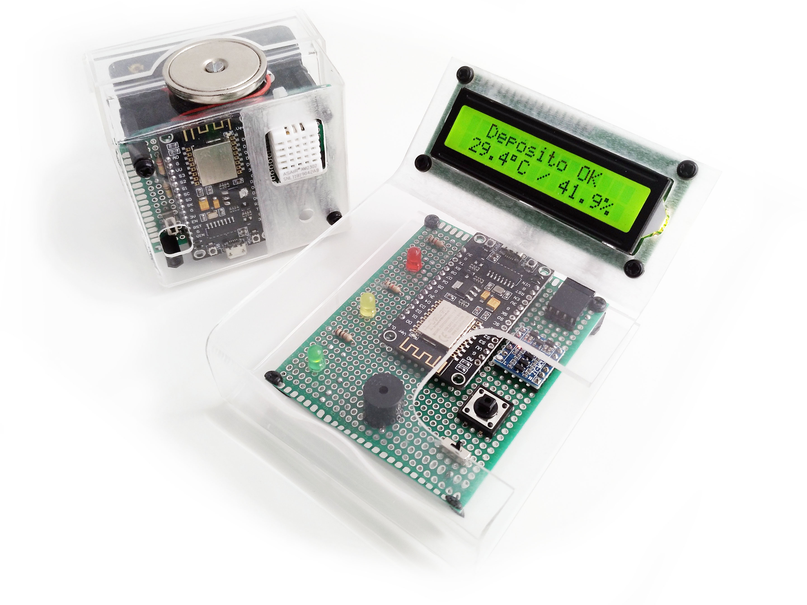

To make the exterior module really cordless, I opted for powering it with batteries (the interior module works with a standard USB cable).
In order to save power, the NodeMCU v3 (ESP8266) in the *exterior module* makes extensive use of the [*deep sleep* mode](https://www.espressif.com/sites/default/files/documentation/9b-esp8266-low_power_solutions__en.pdf).

Since the CMS is to be used by non-technical users, I opted for using 4 regular AA NiMH batteries for powering the exterior module: they are widespread, easy to charge, and easy to replace in case of damage. 4 NiMH batteries provide max 5.6 volts when fully charged, providing most of the time nearly 4.8 volts. These voltages are enough to power the internal voltage regulator of the NodeMCU v3 (an AMS1117), and provide the 3.3 volts required by the ESP8266 considering the dropout voltage of the regulator.

Nevertheless, the quiescent current of the AMS1117 is still too high (~5mA), draining considerable battery even in deep sleep. For such a reason, the NodeMCU v3 board of the *exterior module* has been modified, changing the AMS1117 voltage regulator by a [AP7361C-33ER-13 low dropout regulator](https://www.digikey.es/product-detail/es/diodes-incorporated/AP7361C-33ER-13/AP7361C-33ER-13DICT-ND/8545922), which is pin compatible with the AMS1117, has a considerably lower quiescent current (~60uA), and remains within the specs when powered using 4 AA NiMH batteries.

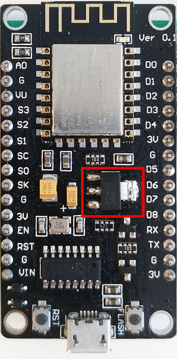

Other parts of the NodeMCU v3 also consume battery in sleep mode, but this modification is simple and good enough to make the exterior module battery to last for weeks without further hacks. Next plot shows how the battery voltage changes (until the exterior module dies), when the exterior module wakes up and connects to the wifi to send data once every minute. In that case, the battery *exterior module* lasts for nearly 20 days.

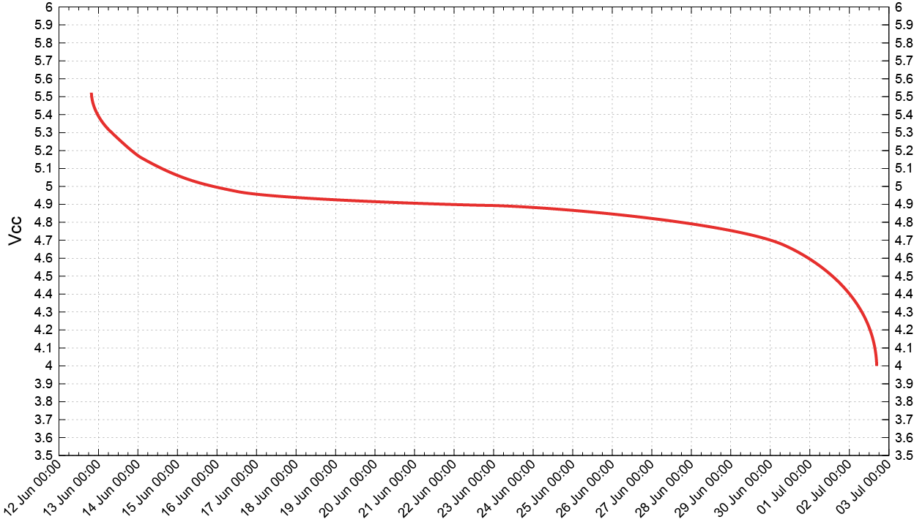

In normal conditions, this period can be increased notably, and as a consequence, the battery lasts for several months.

## User Manual (:warning: Only in spanish! :warning:)

There's available a full user manual of the CMS in [`doc/manual-ES/out/document.pdf`](doc/manual-ES/out/document.pdf).

## Interior module

### PCB

#### Bill of materials

Qty | Description
---:|------------
  1 | Double-sided PCB (70mm x 90mm)
  1 | NodeMCU v3 (ESP8266)
  1 | 16x2 LCD display HD44780 1602A
  1 | FC-113 I2C interface for 1602A 
  1 | Push button (normally open)
  1 | Red LED
  1 | Yellow LED
  1 | Green LED
  2 | 1 kΩ resistor
  1 | 100 Ω resistor
  1 | Piezo buzzer
  1 | Logic level converter
  1 | 2 position switch (3 pin)
 -- | Pin headers
 -- | Dupont connectors
 -- | Wires

#### PCB Design

Front                                                                                               | Back
:--------------------------------------------------------------------------------------------------:|:-------------------------------------------------------------------------------------------:
[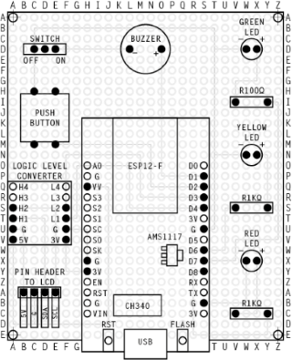](doc/design/interior-board-front.pdf)   | [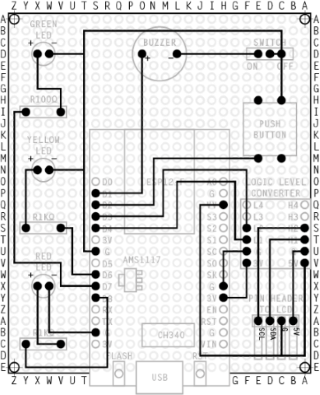](doc/design/interior-board-back.pdf)
[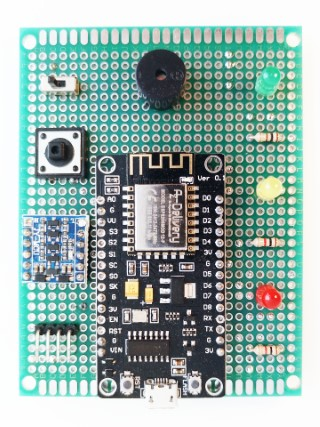](doc/photos/interior-pcb-front.jpg) | [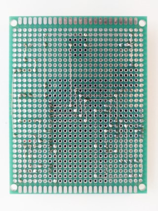](doc/photos/interior-pcb-back.jpg)

### Stand 

#### Bill of materials

Qty | Description
---:|------------
  1 | Methacrylate sheet 3mm thick (270mm x 90mm)
  8 | M3 nylon hex nuts
  8 | M3 x 6mm nylon Phillips head screws
  4 | M3 x 6mm + 6mm nylon screws

#### Stand Design

Description                   | Blueprint / Representation
:----------------------------:|:-----------------------------------------------------------------------------------------:
**Interior body template**    | [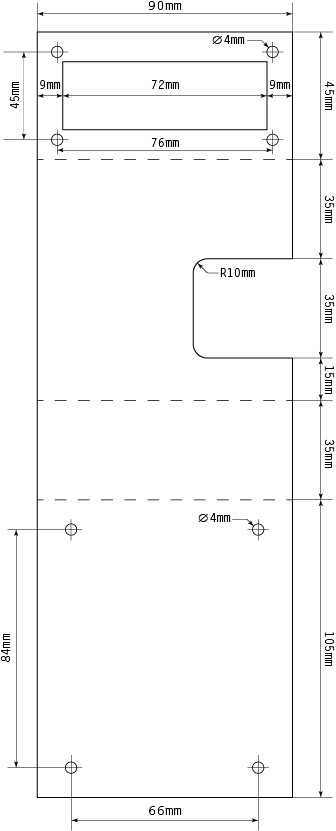](doc/design/interior-body-blueprint.pdf)
**Interior body (side view)** | [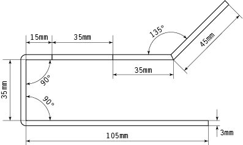](doc/design/interior-body-side.pdf)
**Interior (design view)**    | [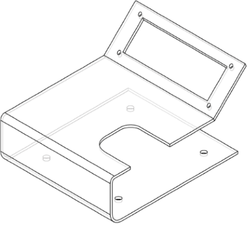](doc/design/interior-body-design.pdf)
**Result**                    | [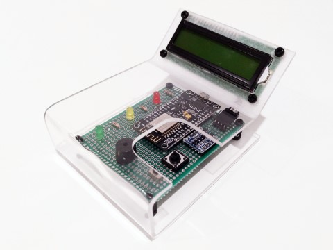](doc/photos/interior.jpg)

## Exterior module

### PCB

#### Bill of Materials

Qty | Description
---:|------------
  1 | Double-sided PCB (50mm x 70mm)
  1 | 1 NodeMCU v3 (ESP8266)
  1 | 1 DHT22 sensor board
  1 | AP7361C-33ER-13 low dropout regulator
  1 | Push button (normally open)
  1 | 4 AA Battery holder
  1 | Float switch (normally closed, but can be easily changed)
  1 | 100 Ω resistor
  1 | 220 Ω resistor
  1 | 2 position switch (3 pin)
 -- | Pin headers
 -- | Dupont connectors
 -- | Wires

#### PCB Design

Front                                                                                               | Back
:--------------------------------------------------------------------------------------------------:|:------------------------------------------------------------------------------------------:
[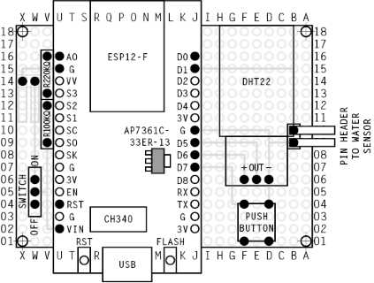](doc/design/exterior-board-front.pdf)   | [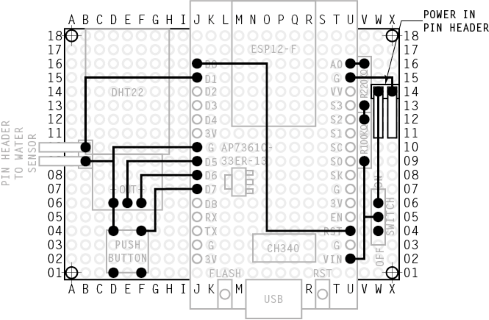](doc/design/exterior-board-back-pdf)
[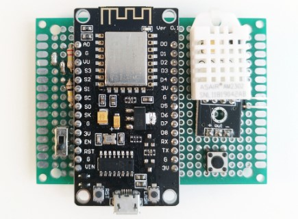](doc/photos/exterior-pcb-front.jpg) | [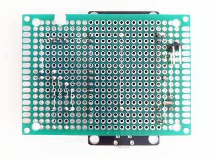](doc/photos/exterior-pcb-back.jpg)

### Case

#### Bill of Materials

Qty | Description
---:|------------
  1 | Methacrylate sheet 3mm thick (105mm x 70mm)
  1 | Methacrylate sheet 2mm thick (125mm x 115mm)
  1 | Methacrylate sheet 2mm thick (170mm x 160mm)
  4 | M3 nylon hex nuts
  2 | M3 x 6mm nylon Phillips head screws
  4 | M3 x 10mm + 6mm nylon screws

Additionally, a countersunk magnet can be attached to the top of the case to attach the device to the steel case of the external A/C unit:

Qty | Description
---:|------------
  1 | Countersunk magnet (⌀30mm)
  1 | M3 x 10mm countersunk screw
  2 | M3 steel hex nuts
 -- | Washer(s)

#### Case Design

Description                       | Blueprint / Representation
:--------------------------------:|:--------------------------:
**Exterior main case template**   | [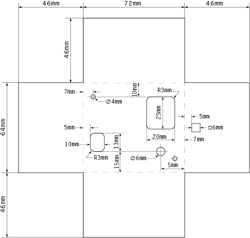](doc/design/exterior-body-blueprint.pdf)
**Exterior lid template**         | [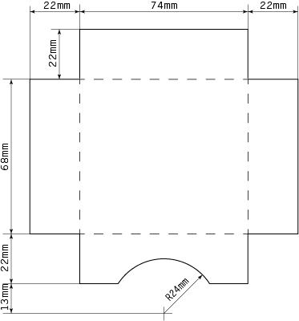](doc/design/exterior-cover-blueprint.pdf)
**Exterior skeleton template**    | [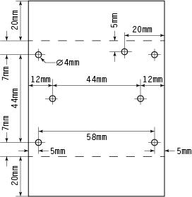](doc/design/exterior-skeleton-blueprint.pdf)
**Exterior skeleton (side view)** | [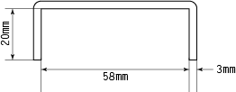](doc/design/exterior-skeleton-side.pdf)
**Exterior (design view)**        | [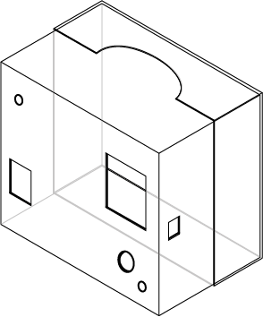](doc/design/exterior-body-design.pdf)
**Result**                        | [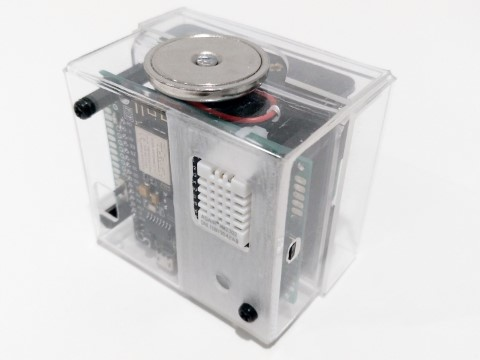](doc/photos/exterior.jpg)

## Dependencies

Library name                | License      | Repository URL
----------------------------|:------------:|----------------
**ArduinoJson**             | MIT          | https://github.com/bblanchon/ArduinoJson
**Adafruit Unified Sensor** | Apache 2.0   | https://github.com/adafruit/Adafruit_Sensor
**DHT sensor library**      | MIT          | https://github.com/adafruit/DHT-sensor-library
**LiquidCrystal_I2C**       | Unknown      | https://github.com/marcoschwartz/LiquidCrystal_I2C
**PubSubClient**            | MIT          | https://github.com/knolleary/pubsubclient
**TaskScheduler**           | BSD 3-Clause | https://github.com/arkhipenko/TaskScheduler
**uMQTTBroker**             | MIT          | https://github.com/martin-ger/uMQTTBroker
**WiFiManager***            | MIT          | https://github.com/tzapu/WiFiManager

***NOTE:** WiFiManager has been heavily modified and is included in the `lib` folder. The modified code includes excerpts from [ESP8266HTTPUpdateServer](https://github.com/esp8266/Arduino/blob/interior/libraries/ESP8266HTTPUpdateServer/src/ESP8266HTTPUpdateServer-impl.h) library (LGPL).